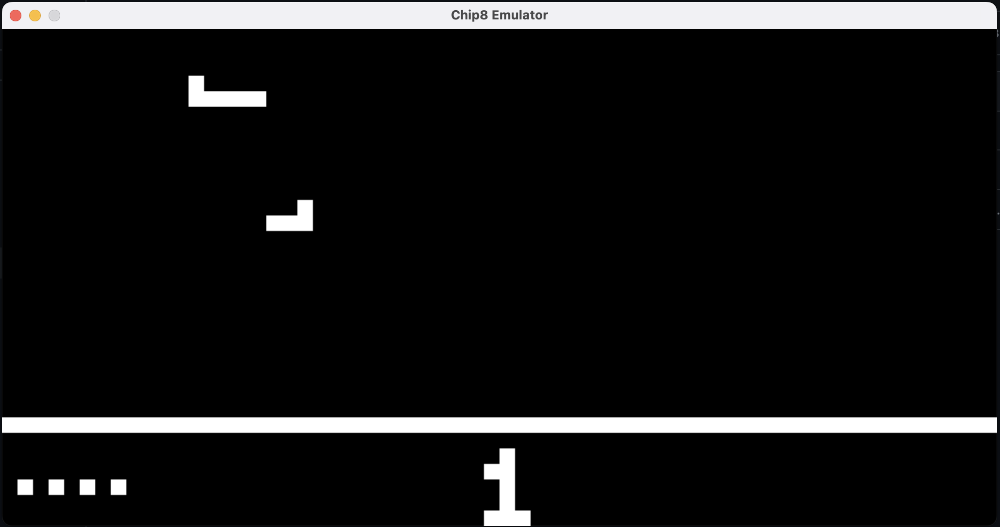

# Chip8 Emulator 

This project is a simple Chip8 emulator implemented in C++. Chip8 is an interpreted programming language used in vintage computers, primarily video game consoles, in the late 1970s and early 1980s. This emulator allows you to run Chip8 programs on modern computers.

## Project Overview

The project consists of the following files:

- `main.cpp`: Contains the main function where the emulator is initialized and run.
- `chip8.cpp`: Contains the implementation of the `Chip8` class, which represents the Chip8 emulator.
- `chip8.h`: Contains the declaration of the `Chip8` class and other necessary declarations.

## Dependencies

The project depends on the Simple DirectMedia Layer (SDL) library for handling graphics and user input. Make sure you have SDL2 installed on your system before building the project.

**NOTE** Since I couldn't get SDL2 working on my mac by a brew install, I manually downloadded the files, placed them in my source direcrtory and included them using the makefile manually. The SDL2 files are in the repo under `src/include/` and `src/lib`. If you use the provided makefile, then you will require those header files from SDL2. 

## Building Instructions

To build the project, you can use the provided Makefile. Make sure you have `clang++` or `g++` installed on your system. The makefile uses clang++ for compilation, but you can simply replace the line `clang++ main.cpp chip8.cpp ...` with `g++` or any other compilers you might want to use.

```bash
make chip8
```

This will compile the source files and link them together to produce an executable named `out`.


```bash
make clean
```

To clean up the files previously generated by `make run`

## Usage

After building the project, you can run the emulator by executing the generated executable with you choice of argument (rom file path):

```bash
./out <path_to_rom>
```

Or you could simply use the makefile privided, which has the `Airplane.ch8` file provided as an argument:

```bash
make play
```

This will start the chip8 emulation with the provided file in the makefile, which is `Airplane.ch8`.

The emulator will start, and you will see a window representing the Chip8 display. You can then load Chip8 ROMs into the emulator and interact with them using the keyboard.



## Chip8 ROMs

You can find various Chip8 ROMs available online. These ROMs contain programs and games written in the Chip8 programming language. Place the ROM files in the same directory as the executable (`out`), or you can place them under the `rom/` folder and provide a path to the program accordingly.

(Some of the roms used for testing are included in the repo under /roms)

Here's a link for the repo where I got these roms from: https://github.com/kripod/chip8-roms

## Controls

The keyboard layout for controlling the emulator is as follows:

```
Chip8 Keypad      Keyboard
+-+-+-+-+        +-+-+-+-+
|1|2|3|C|        |1|2|3|4|
+-+-+-+-+   =>   +-+-+-+-+
|4|5|6|D|        |Q|W|E|R|
+-+-+-+-+        +-+-+-+-+
|7|8|9|E|        |A|S|D|F|
+-+-+-+-+        +-+-+-+-+
|A|0|B|F|        |Z|X|C|V|
+-+-+-+-+        +-+-+-+-+
```

## Contributing

Contributions are welcome! If you find any issues or have suggestions for improvements, feel free to open an issue or submit a pull request.

## License

This project is licensed under the MIT License - see the [LICENSE](LICENSE) file for details.
